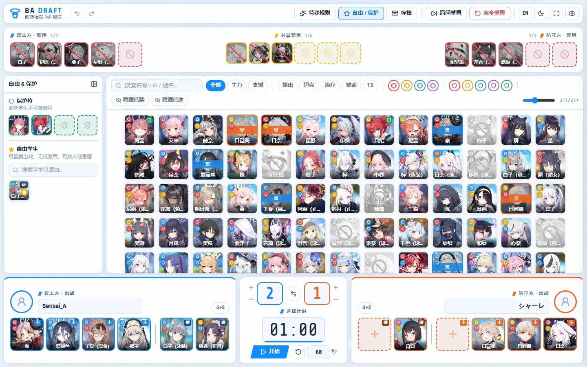
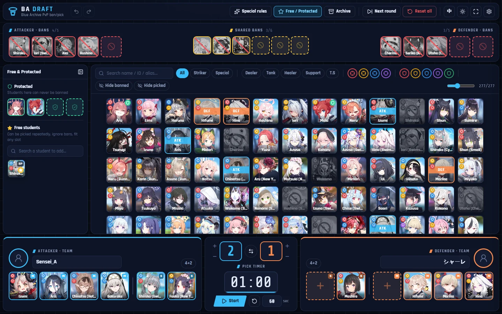

<div align="center">

# BA Draft Tool

**English** · [简体中文](README.zh-CN.md)

A ban/pick drafting board for unofficial **Blue Archive** PvP tournaments.<br>
Built for hosts and casters: drag students into bans and teams, the rules are enforced for you.

[](https://github.com/Kazeshima/BA-BP/actions/workflows/ci.yml)
[](https://github.com/Kazeshima/BA-BP/releases/latest)
[](LICENSE)

[**Download for Windows**](https://github.com/Kazeshima/BA-BP/releases/latest) · [**Open in browser**](https://kazeshima.github.io/BA-BP/) · [User guide](docs/user-guide.md)

 

</div>

## Features

- **Full roster from [SchaleDB](https://schaledb.com)**, with names in 简中 / 国服 / 繁中 / 日本語 / 한국어 / English, filtered to what's released on the JP, Global or CN server. Cached for offline use.
- **Drag-and-drop drafting**: per-side bans, up to 80 shared bans, and teams in **4 Striker + 2 Special** or **6 generic** slots.
- **Rules enforced as you drag**: slots light up green or red before you drop. You can't pick banned students, pick a student twice, or put a Striker in a Special slot. Illegal drops explain why.
- **Special rules mode** lifts the restrictions for exhibition games. It can only be turned off once the board is legal again, and any slot that breaks the rules is highlighted.
- **Free students** (can be picked repeatedly and ignore bans) and **protected students** (can never be banned).
- **Undo / redo** for every board change (`Ctrl+Z` / `Ctrl+Shift+Z`).
- **Scoreboard and pick timer**: pause and resume, a progress bar, and optional countdown beeps (`Space` to start or pause).
- **Next round** keeps shared bans and scores. **Reset all** starts over.
- **Archive** hides students you never want in the pool.
- **Bilingual UI** (中文 / English), **light and dark themes**, and fullscreen mode (`F11`) for streaming.
- **Everything persists**: the board, player names, avatars and settings survive a restart. Settings from v1.x are migrated automatically.
- **Lightweight desktop app** (Tauri + WebView2, a few MB) with a portable `.exe`, and the same app on the web.

## Download

| | |
|---|---|
| **Windows installer** | `BA-Draft-Tool_<version>_x64-setup.exe` from [Releases](https://github.com/Kazeshima/BA-BP/releases/latest) |
| **Windows portable** | `BA-Draft-Tool_<version>_x64-portable.exe`, no install needed |
| **Web** | <https://kazeshima.github.io/BA-BP/>, works in any modern browser |

The desktop app needs [WebView2](https://developer.microsoft.com/microsoft-edge/webview2/), which ships with Windows 10 and 11. It checks GitHub for new versions once a day and shows a notice when one is available.

## Quick start

1. Launch the app. The student list loads from SchaleDB.
2. **Ban**: drag a student from the roster into a red ban slot (or a gold shared-ban slot).
3. **Pick**: drag students into each team's slots. Use the `4+2` / `6 any` toggle to switch layouts.
4. **Fix mistakes**: drag a student back onto the roster, right-click the slot, or press `Ctrl+Z`.
5. **Between games**: use **Next round**, update the score, and **⇄** to swap sides.

See the [user guide](docs/user-guide.md) for every rule and shortcut.

## Development

Requires Node.js 22+ and pnpm. The desktop build also needs Rust and the [Tauri prerequisites](https://v2.tauri.app/start/prerequisites/).

```bash
pnpm install
pnpm dev            # web app at http://localhost:1420
pnpm tauri dev      # desktop app with hot reload
pnpm check          # lint + typecheck + tests + version check
pnpm tauri build    # Windows installer
```

**Releasing** is automatic. Bump the version and push to `main`:

```bash
pnpm version:bump patch     # or minor / major / 2.1.0-beta.1
git commit -am "chore: release v2.0.1" && git push
```

CI builds the installer and portable exe, publishes a GitHub Release with notes, and deploys the web version. The pipeline runs on free GitHub-hosted runners and never uploads workflow artifacts. See [docs/development.md](docs/development.md) for the architecture and the CI/CD design.

## Credits

Student data and images: [SchaleDB](https://schaledb.com). *Blue Archive* is a trademark of NEXON Games / Yostar. This is an unofficial fan project, not affiliated with them.

Licensed under the [MIT License](LICENSE).
